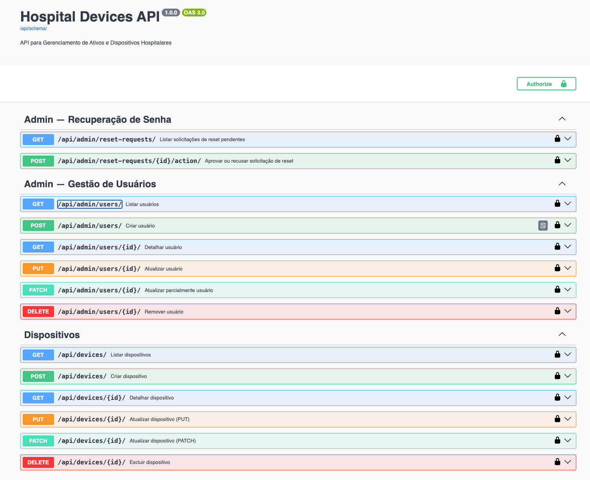
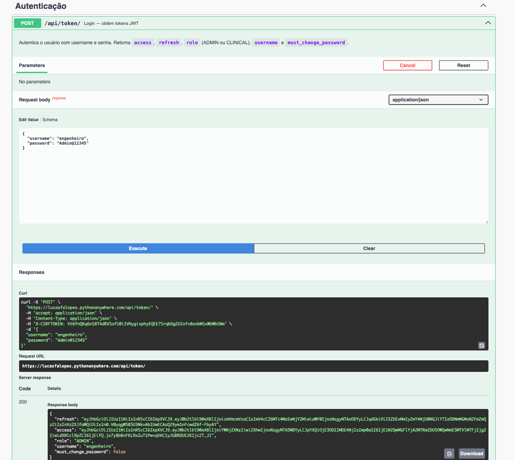
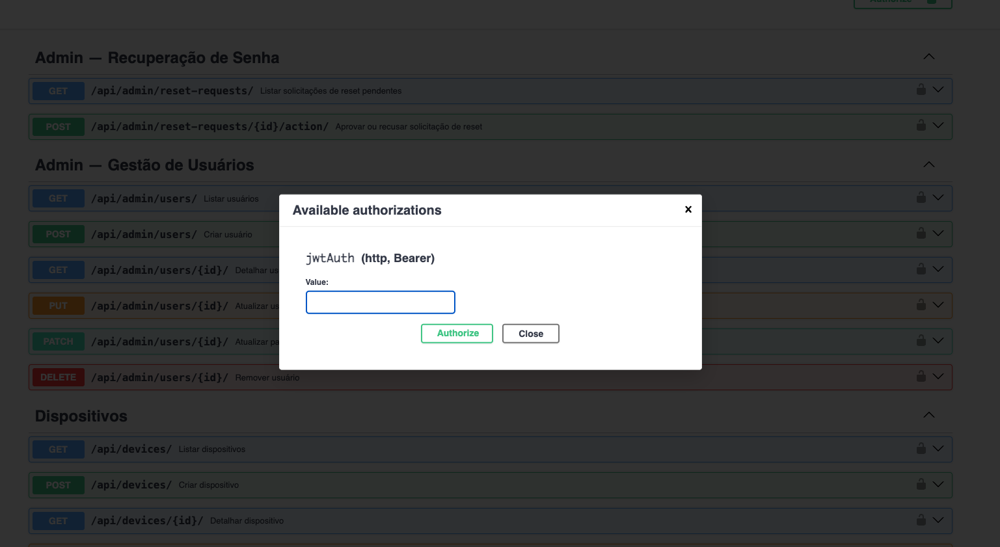
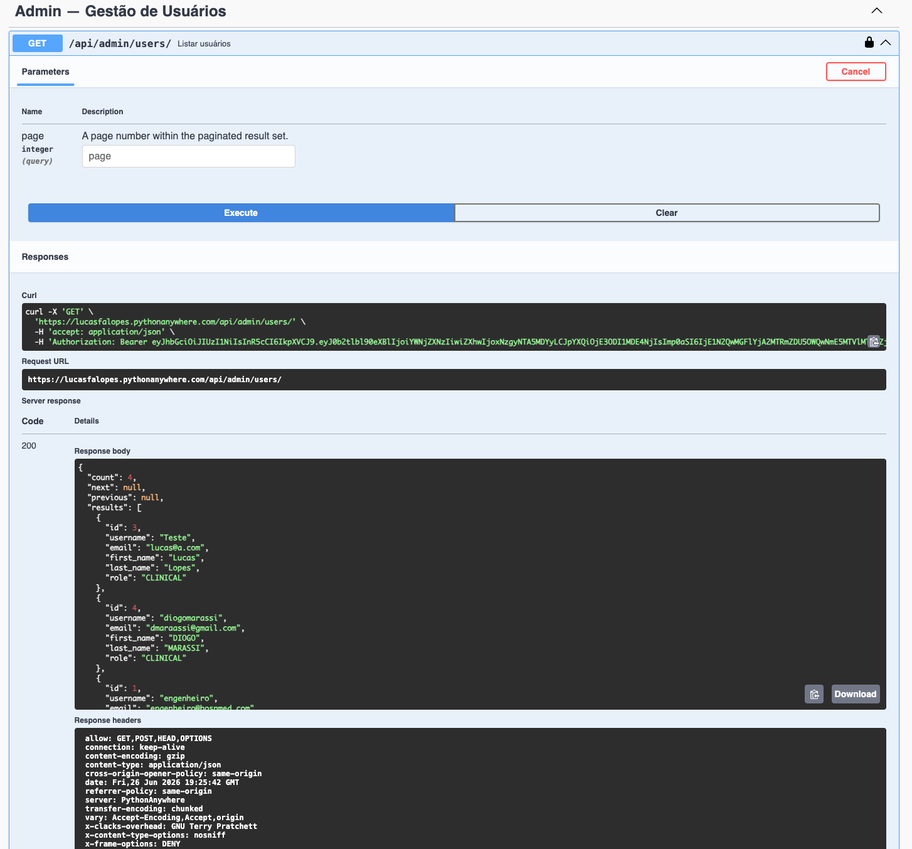

# Sistema de Gerenciamento de Ativos Hospitalares - Backend

- Lucas Lopes - 2220647
- Diogo Marassi - 2220354

## Links Relevantes
* **Site Backend (Deploy do Swagger API):** [https://lucasfalopes.pythonanywhere.com/api/docs](https://lucasfalopes.pythonanywhere.com/api/docs)

## Escopo do Projeto
Este projeto é o Backend de um sistema de gerenciamento de dispositivos médicos e ativos de um hospital. Desenvolvido inteiramente em Django (sem uso de templates HTML/CSS, seguindo o requisito), ele provê uma API RESTful completa para atender o Frontend.
O sistema conta com endpoints protegidos por JWT e diferentes níveis de permissão.

## O que foi desenvolvido
* **CRUD de Dispositivos:** Endpoints completos para criar, listar, atualizar e deletar dispositivos médicos.
* **Autenticação:** Sistema de login seguro com JWT.
* **Gerência de Senhas:** Fluxo de "esqueci minha senha" onde o usuário solicita a troca e um administrador (Engenheiro) aprova no painel.
* **Controle de Acesso:** Diferentes visões do sistema. Engenheiros possuem privilégios administrativos (aprovação de reset de senhas, CRUD total) enquanto Médicos possuem acesso restrito.
* **Documentação OpenAPI (Swagger):** Integração com `drf-spectacular` para documentar todas as rotas e facilitar o uso.

## Manual do Usuário e Passo a Passo do Swagger

Para interagir com a nossa API na nuvem e testar as rotas, siga este passo a passo documentado:

### 1. Tela Inicial do Swagger
Ao acessar o link da nossa API, você verá a interface inicial listando todas as rotas disponíveis no sistema.



### 2. Geração de Token (Login)
Para testar a maioria das rotas (como listar e criar dispositivos), você precisará estar autorizado. Vá na rota `POST /api/token/`, clique em **Try it out** e preencha com o login e senha de um usuário válido. O sistema gerará um token de acesso (`access`). Copie esse token.



*Credenciais de teste:*
* **Engenheiro (Admin):** `username`: `engenheiro` | `password`: `Admin@12345`

### 3. Autorizando o Swagger
Vá até o topo da página do Swagger e clique no botão verde **Authorize** (ou no ícone do cadeado de qualquer rota protegida). Na caixa de autorização, cole o seu token no campo de valor e clique em *Authorize*. A partir desse momento, todas as suas requisições enviarão o JWT automaticamente!



### 4. Uso de Rotas Restritas (Ex: Listar Usuários)
Agora você pode testar rotas fechadas! Como exemplo, execute o endpoint de listar usuários (`GET /api/admin/users/`).
*Observação:* Para acessar essa rota especificamente, além do token, o usuário autenticado deve ter a permissão de Administrador (role ADMIN), conforme implementado nas regras de negócio da aplicação.



## Como Instalar e Rodar Localmente

### Pré-requisitos
* Python 3.9+
* uv (gerenciador de pacotes - ou pip)

### Passos
1. Clone o repositório:
   ```bash
   git clone <LINK_DO_REPO_BACKEND>
   cd trab2-prog-web-back
   ```

2. Crie e ative o ambiente virtual:
   ```bash
   uv venv --python /usr/bin/python3
   source .venv/bin/activate
   ```

3. Instale as dependências:
   ```bash
   uv pip install -r requirements.txt
   ```

4. Aplique as migrações no banco de dados SQLite e crie os dados iniciais:
   ```bash
   python manage.py migrate
   python manage.py seed
   ```

5. Rode o servidor local:
   ```bash
   python manage.py runserver
   ```
   Acesse a documentação: `http://localhost:8000/api/docs/`

## Funcionalidades Testadas (Testes Manuais Realizados)

### O que funcionou (Testado e Aprovado)
* Login de usuário e geração de token JWT.
* Restrição de acesso em endpoints protegidos (401 Unauthorized retornado corretamente caso o acesso seja anônimo).
* Solicitação de "Esqueci a Senha" via fluxo de aprovação administrativo.
* Todas as 4 operações (CRUD) da API de dispositivos funcionando de acordo.
* Documentação no Swagger UI renderizando perfeitamente todos os *schemas*.

### O que não funcionou
* O envio automático de e-mail com link de reset de senha foi cogitado inicialmente, mas, devido a limitações de configuração e chaves de servidor SMTP em ambientes de nuvem variados, optamos por não implementar o disparo de e-mails reais. A funcionalidade foi plenamente substituída com sucesso por um painel onde o administrador aprova manualmente as solicitações. Relatamos isso como escolha de design.